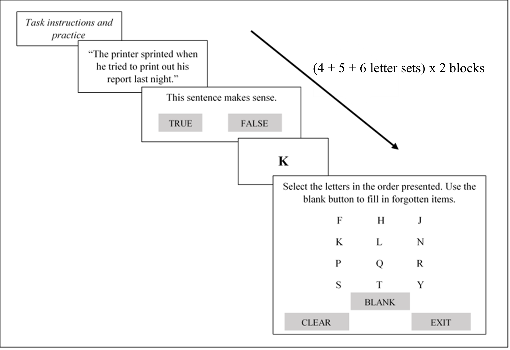
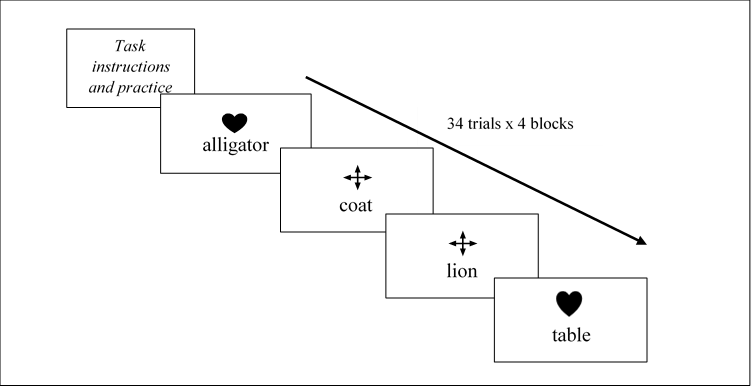
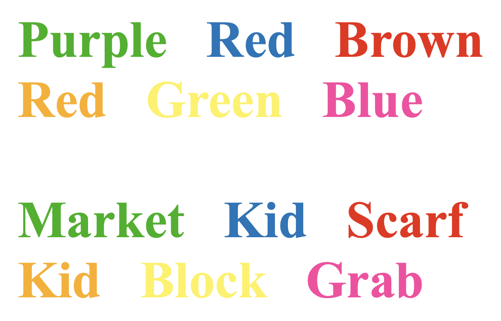

# Music listening mitigates self-control fatigue and sustains cognitive performance during a prolonged reading comprehension task

This repository accompanies the research paper and provides implementations of three cognitive tasks used in the study: the Reading Span Task, the Category Switch Task, and the Incongruent Colour-Word Stroop Task.

## Study Design

The study used a between-subjects design. Participants completed a 30-minute reading comprehension session either while listening to instrumental background music or without music. The study assessed reading comprehension, self-control fatigue, and positive and negative affect. Reading comprehension and questionnaire measures were administered in Qualtrics; this repository contains the cognitive task implementations described below.

## Tasks Used in the Study

The paper's Figures 1 and 2 illustrate the Reading Span and Category Switch procedures.

### Figure 1. Reading Span Task

Participants judged whether each sentence made sense, then recalled the letters presented between sentences in the order shown. A modified Reading Span Task measured baseline verbal working memory capacity.

[Task implementation](psychopy-reading-span-task/) · [Task documentation](psychopy-reading-span-task/readme.md)

### Figure 2. Category Switch Task

Participants classified words according to a heart or cross cue, switching between living/nonliving and big/small judgments. The Category Switch Task measured divided attention.

[Task implementation](psychopy-category-switch-task/) · [Task documentation](psychopy-category-switch-task/readme.md)

### Incongruent Colour-Word Stroop Task

*Illustrative example only: the image shows incongruent (top) and neutral (bottom) stimuli, not the exact congruent and incongruent trials used in this study. Image by [Unreferierbar via Wikimedia Commons](https://commons.wikimedia.org/wiki/File:Stroop_stimuli_example.png), dedicated to the public domain under [CC0 1.0](https://creativecommons.org/publicdomain/zero/1.0/).*

The study used the Incongruent Colour-Word Stroop Task as a behavioural measure of self-control fatigue, a common use of the Stroop task. Participants responded to the ink colour of colour words on congruent and incongruent trials. The Stroop effect was calculated as reaction time (RT) on incongruent trials minus RT on congruent trials; a larger difference indicates greater response interference, poorer performance, and a higher level of self-control fatigue.

Because the Stroop task can also induce fatigue, it was administered after the 30-minute reading session so that it functioned as an outcome measure. The experiment was implemented in PsyToolkit. The paper also assessed fatigue using pre- and post-session self-reports on the Motivation for Cognition State Scale.

[Stroop task files and code](psytoolkit-stroop-task/)

## Running and Modifying

The Reading Span and Category Switch folders contain PsychoPy experiment files, Python scripts, stimuli, and generated browser builds. After editing an experiment in PsychoPy, compile it to JavaScript before testing the browser version. Serve the task folder through a web server rather than opening `index.html` directly. The generated JavaScript imports PsychoJS files from a local `lib/` directory, which is not included in these task folders; add the matching runtime files from a complete PsychoPy export before running the browser build.

The Stroop experiment code is in `psytoolkit-stroop-task/experiment_codes.txt` and can be opened or adapted in PsyToolkit. Task-specific design and configuration details are available in the [Reading Span documentation](psychopy-reading-span-task/readme.md) and [Category Switch documentation](psychopy-category-switch-task/readme.md).
